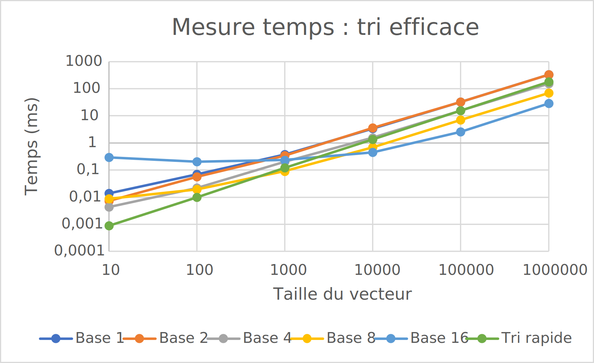

# L3 - Tris

# Rapport

Groupe : L3G2

Alan Sottile, Calvin Graf, Lucas Hussain

***
# 1. Introduction

À l'instar du laboratoire 1, ce labo consiste en la réalisation et l'analyse de tri. Cependant les 2 types de tris que nous devons réaliser pour ce travail sont beaucoup plus efficace que les 3 tris de bases que nous avons pu faire précédemment.

Les 2 tris à réaliser sont le **tri rapide** et le **tri par base**. Toutefois, pour ce labo, nous devons seulement étudier leurs temps d'exécution.
Nous devons également réaliser 2 programmes, le premier doit vérifier que nos 2 tris fonctionnent correctement et le deuxième nous servira à mesurer le temps d'exécution de chaque tri avec différents paramètres afin d'en faire un graphique final.

Nous a déjà été fourni de base : les interfaces ainsi qu'une classe Somebits contenant un foncteur pour la réalisation du tri par base.

***
# 2. Tri

## 2.1. Tri rapide

Le tri rapide est un tri qui utilise la récursion pour diviser un tableau en sous tableaux plus petits à trier en utilisant un pivot, jusqu'à ce que le tableau soit complètement trié.

Dans le cas de cette étude, le choix du pivot pour notre tri rapide se fait aléatoirement parmi les valeurs du tableau.

Sa complexité moyenne est de **O(n * log(n))**.

## 2.2. Tri par base

Le tri par base se fait en deux parties. La première partie consiste à faire un tri comptage. Nous avons donc codé cette fonction.

La deuxième partie effectue le tri par base en utilisant les bits comme groupe. Il est possible de modifier un paramètre pour que le tri fonctionne avec des groupes de 1, 2, 4, 8 ou 16 bits comme demandé dans la consigne.

Sa complexité moyenne est de **O(d * (n + b))**.

## 2.3. Graphe

| n           | 10  | 100 | 1000 | 10000 | 100000 | 1000000 |
| ----------- | --- | --- | ---- | ----- | ------ | ------- |
| Tri base 1  |0,0139|0,0694|0,3737|3,362|32,206|327,219
| Tri base 2  |0,0074|0,0567|0,3441|3,6356|32,5366|326,508
| Tri base 4  |0,0043|0,0219|0,2022|1,5503|15,6955|153,961
| Tri base 8  |0,0088|0,0192|0,0906|0,6855|6,9564|69,7687
| Tri base 16 |0,2953|0,2027|0,2334|0,4555|2,5881|28,5183
| Tri rapide  |0,0009|0,0098|0,1228|1,36|15,7701|180,633

_Lien vers le [fichier csv](csv/mesure_tri.csv)_

***
# 3. Analyse

On peut voir plusieurs choses intéressantes sur ce graphe. Premièrement, on voit que le temps d'exécution se stabilise à partir d'environ 10'000 éléments. Ensuite, on peut voir que la base la plus rapide varie en fonction de la taille de notre vecteur. Pour un vecteur de moins de 500 éléments, il faudra utiliser la base 16 pour obtenir des meilleurs résultats. Si l'on a un vecteur plus grand, alors la base 1 ou la base 2 semblent être de meilleures options.

On peut également voir que notre tri rapide est plus lent que notre tri par base, notamment lorsque nous avons moins de 1000 éléments. Cela peut s'expliquer par le fait que le tri rapide peut être encore optimisé pour obtenir de meilleurs résultats mais également qu'un tri par base aura plus de facilité à trier des petits vecteurs.

***
# 4. Conclusion

En conclusion, nous avons désormais quel tri utilisé pour quel cas grâce à l'analyse des résultats obtenus. Nous pouvons voir que nous aurons de meilleurs résultats avec notre tri par base qu'avec notre tri rapide. Ces résultats pourraient être différents si l'on optimisait au mieux notre tri rapide.